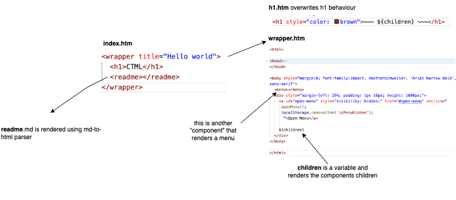

# Walkthrough

Basically CTML allows you to refer to other files by refering to the files using the html syntax.

The parser will always look in the codebase for an `.htm` or `.md` or `.csv` or `.json` file, for any html tag that occurs.

- `.htm` is further parsed
- `.md` is parsed to html
- `.csv` and `.json` are looped over, and children are repeated for each item

These simple rules allow you to build with building blocks much like in React, while staying much closer to actual html.
